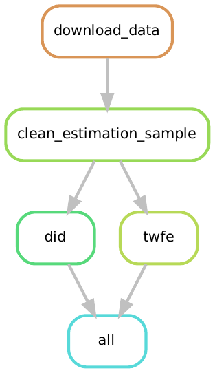

# Many Economists Project Task 3

Researcher ID: 579

## Installation Instructions

Follow these Steps to install the necessary software on your system

You need to have the following software and packages installed:

1. Python 3 (Python 3.6 or higher)
2. Snakemake (we'll install the correct version in a couple of lines time!)
3. R (version 4.0.x)

### Installing Python

Either:

1. Install Anaconda Python:
    - We provide instructions on how to install anaconda python [here](https://pp4rs.github.io/2020-uzh-installation-guide/python/)
2. Install Python using the deadsnakes ppa:
    - Here's how to add the deadsnakes ppa and install Python 3.8
    ```bash
    $ sudo apt-get install software-properties-common
    $ sudo add-apt-repository ppa:deadsnakes/ppa
    $ sudo apt-get update
    $ sudo apt-get install python3.8
    ```

### Installing Snakemake

We have included a `requirements.txt` file that we can use to install a specific version of snakemake.
This makes sure that our example runs on your machine (or at least won't break because you use a different version of snakemake than we do)

``` bash
pip3 install -r requirements.txt
```

you may need to replace `pip3` with `pip`

**Note:** In recent versions of Snakemake you must state how many cores you want to use when executing rules. 
In this example, we encourage the use of a single core, so when we use snakemake we will always write it as `snakemake --cores 1 <something>`.
More cores speeds things up, but our example is quite light so it seems unnecessary.

### Installing `R`

We provide instructions on how to install R [here](https://pp4rs.github.io/2020-uzh-installation-guide/r)

### Install the Required `R` libraries

We utilize many additional R packages inside the scripts that build our project.
To ensure that our project runs on every machine without issues relating to R packages not being installed we utilize `renv` to control the list of packages needed to run this example, and to monitor the version of the package we use.

Once you have completed the installation instructions above, we have provided a simple command to install renv.
Open a terminal and navigate to this directory.
Then in the terminal enter the following command to install renv:

``` bash
snakemake --cores 1 renv_install
```

Then you will need to provide consent for `renv` to be able to write files to your system:

``` bash
snakemake --cores 1 renv_consent
```

Once this is complete you can use renv to create a separate R environment that contains the packages we use in our example by entering the following command into the terminal:

``` bash
snakemake --cores 1 renv_init
```

The above command will initialize a separate R environment for this project.

Now we will install the necessary packages (and their precise versions) which are stored in the `renv.lock` file:

``` bash
snakemake --cores 1 renv_restore
```

This will install all the packages we need. It may take a while.

## Running the Code:

Once the installation instructions are complete, we can run the project.
The result will be a stored estimation file for each model specification and a log file that prints the estimation results for each model specification.

The data is downloaded from a GitHub repository as part of the workflow. 
Thus you do not need to download the data yourself.

```
snakemake --cores NUM_CORES all
```

Note that you must be in this project's working directory when running the snakemake command. For example,:

```bash
YOUR/FILE/PATH/manyeconomists$ snakemake --cores 12 all 
```

and NUM_CORES needs to be a number between 1 and the number of cores on your PC.

Depending on the number of cores chosen, it may take a while.

## Visualization of the Workflow

Snakemake workflows are a directed acyclic graph (DAG).
We can visualize the relationship between the rules (a simplified view of the DAG) in our workflow:



A DAG of the full workflow is available in the file [dag.pdf](dag.pdf)